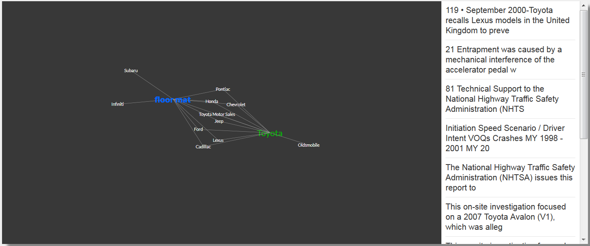

# wcp-kg
Watson Discovery service Network Graph app written in Python



Special thanks to [zwalchuk](https://github.com/zwalchuk)
This app was modified from his original code https://github.com/zwalchuk/news-visualization

This Python app allows a user to query their own Watson Discovery Service collection and produce a network graph visualization.

#### To run this app:
1. Create an instance of [Watson Discovery service](https://console.bluemix.net/catalog/services/discovery) on IBM Cloud
2. Clone this repo and navigate to the "wcp-kg" directory:
```
git clone https://github.ibm.com/jmsalai/wcp-kg.git
cd wcp-kg
```
3. Copy the file ".env.example", rename the copy ".env", and provide the following parameters:
    * Provide the Watson Discovery Service `apikey` and `url` endpoind
    * Provide the Watson Discovery Service `collection_id` and `environment_id`
4. Modify manifest.yml if you'd like to add additional paramters or change the app's name

##### To run locally:
- Install the app's dependencies:
```
pip install -r requirements.txt
```
- Launch the app:
```
python3 app.py
```
- Running locally, enter serach term ("keyword"), session ID, and team name as query strings following hostname and port
- E.g.,
http:localhost:8000/keyword?keyword=Joyce E. Morrow&sessionId=1D3BFE67Z&team=pink

##### To run on IBM Cloud:
1. Run the following command in the [IBM Cloud CLI](https://console.bluemix.net/docs/cli/reference/bluemix_cli/download_cli.html#download_install)
```
ibmcloud cf push
```
- After launching IBM Cloud app URL, enter serach term ("keyword"), session ID, and team name as query strings following hostname and port
- E.g.,
https://wcp-graph.mybluemix.net/keyword?keyword=Joyce E. Morrow&sessionId=1D3BFE67Z&team=pink
